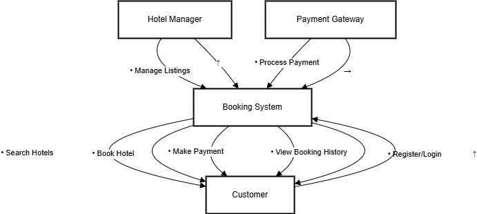

# requirement-analysis
# Requirement Analysis in Software Development

## Introduction

This repository is dedicated to exploring the critical phase of Requirement Analysis in the Software Development Life Cycle (SDLC). 

It serves as a learning and documentation resource covering key concepts such as requirement gathering, elicitation, modeling, validation, and prioritization. The purpose is to provide a structured approach to understanding how software requirements are identified, refined, and confirmed to guide successful project delivery.
## What is Requirement Analysis?

Requirement Analysis is a fundamental phase in the Software Development Life Cycle (SDLC) where stakeholders' needs, expectations, and constraints are gathered, analyzed, and clearly defined to guide the design and development of a software solution.

During this phase, business analysts, system architects, and developers collaborate with clients and end-users to understand the problem the software aims to solve. The goal is to identify both **functional requirements** (what the system should do) and **non-functional requirements** (how the system should perform).

### Importance of Requirement Analysis in SDLC:

- 🔍 **Clarity and Understanding**: It ensures a shared understanding between stakeholders and developers, minimizing misinterpretations.
- 🎯 **Project Scope Definition**: Clearly defined requirements help establish the boundaries of the project, preventing scope creep.
- 💸 **Cost and Time Efficiency**: Early detection and clarification of requirements reduce costly rework and project delays.
- ✅ **Validation and Quality**: Well-documented and validated requirements provide a solid foundation for testing, ensuring the software meets user needs.

Requirement Analysis lays the groundwork for successful project execution, helping teams build the right product — not just build the product right.
## Why is Requirement Analysis Important?

Requirement Analysis plays a vital role in the success of any software project. It acts as the foundation upon which the rest of the software development process is built. Here are three key reasons why it is critical in the Software Development Life Cycle (SDLC):

### 1. Prevents Miscommunication and Misalignment
Clear and well-documented requirements help ensure that all stakeholders — including clients, developers, testers, and project managers — are aligned on the project goals. This minimizes the risk of building the wrong product or missing key functionality.

### 2. Reduces Cost and Time Overruns
By identifying requirements early, teams can avoid costly rework and delays later in the project. A well-conducted requirement analysis helps detect potential issues and ambiguities before development begins, which significantly reduces time and budget overruns.

### 3. Enhances Product Quality and User Satisfaction
Understanding and capturing the real needs of users ensures that the final product meets expectations and delivers value. Requirement Analysis leads to better planning, more accurate testing, and ultimately, a product that solves the right problems effectively.
## Key Activities in Requirement Analysis

Requirement Analysis consists of several structured activities that help teams accurately define and manage software requirements. Below are the five key activities involved:

- **Requirement Gathering**  
  This is the initial step where information about what the software needs to do is collected from stakeholders through interviews, surveys, observation, and existing documentation.

- **Requirement Elicitation**  
  In this phase, deeper exploration is conducted to uncover the true needs of users and stakeholders. Techniques like brainstorming, prototyping, use case development, and focus groups are used to refine and clarify requirements.

- **Requirement Documentation**  
  All gathered and elicited requirements are recorded in a clear and structured format. This includes requirement specification documents, use cases, user stories, and diagrams that serve as a reference throughout the development cycle.

- **Requirement Analysis and Modeling**  
  The collected requirements are analyzed for feasibility, consistency, and completeness. Models such as data flow diagrams (DFDs), entity-relationship diagrams (ERDs), and UML diagrams are used to visually represent the system’s functionality and structure.

- **Requirement Validation**  
  In this final step, the documented requirements are reviewed and validated with stakeholders to ensure accuracy, completeness, and alignment with business goals. Validation helps confirm that the requirements are ready for use in system design and development.
## Types of Requirements

### Functional Requirements

Functional requirements define what the system **should do** — the core features and behaviors that enable users and stakeholders to interact with the system. These are derived directly from the business needs.

**Examples for a Hotel Booking Management System:**

- **User Registration and Login**: Users (both customers and hotel managers) should be able to register and securely log in to the platform.
- **Hotel Listing Management**: Hotel managers should be able to add, update, and delete their property listings.
- **Search Functionality**: Customers should be able to search for hotels by location, price, rating, and availability using the search service (Elasticsearch).
- **Booking Creation**: Customers must be able to book hotels and receive confirmation.
- **Payment Integration**: The system should allow customers to pay via third-party payment services.
- **View Booking History**: Both customers and managers should be able to view current and past booking records.
- **Notification System**: Notifications should be sent to customers and managers when bookings are made or offers are available (via Kafka consumer).

---

### Non-functional Requirements

Non-functional requirements specify **how the system should perform** — defining performance, scalability, reliability, and other quality attributes that support the functional requirements.

**Examples for a Hotel Booking Management System:**

- **Performance**: Search results should be returned in under 2 seconds, even under high user traffic.
- **Scalability**: The system should support horizontal scaling to handle millions of user requests simultaneously (microservices architecture supports this).
- **Availability**: The booking service should have an uptime of 99.9% to ensure continuous availability for users.
- **Security**: All user data must be encrypted in transit and at rest; secure authentication must be enforced.
- **Data Consistency**: Database operations (e.g., booking confirmations) must ensure data consistency across microservices using messaging queues.
- **Caching**: Frequently accessed data should be cached using Redis to reduce database load and response time.
- **Archival and Big Data Handling**: Old booking data should be archived using Cassandra and Hadoop to enable long-term data analysis.

---

Both types of requirements are essential: functional requirements ensure the system *does* what it's supposed to, while non-functional requirements ensure it *performs* well and is usable, secure, and maintainable.
## Use Case Diagrams

Use Case Diagrams are a visual modeling technique used in Requirement Analysis to represent the interactions between users (actors) and the system. They help stakeholders and developers understand the functional scope of the system from a user's perspective.

### 🔍 Benefits of Use Case Diagrams:
- Provide a clear overview of system functionality.
- Help identify different user roles and their interactions.
- Serve as a communication bridge between non-technical stakeholders and technical teams.
- Assist in validating functional requirements early in the development process.

### 🏨 Use Case Diagram for Booking System

The diagram below illustrates a simplified version of a hotel booking platform's use case model. It includes two main actors — **Customer** and **Hotel Manager** — and outlines their core interactions with the system.

